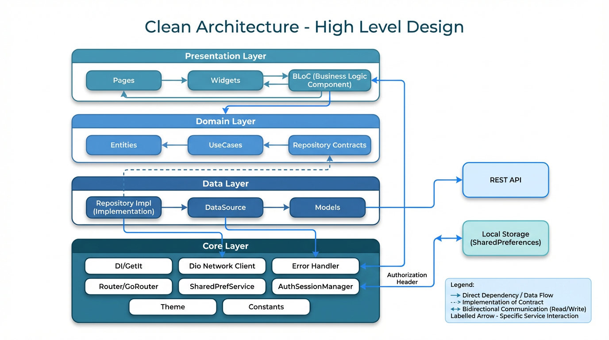
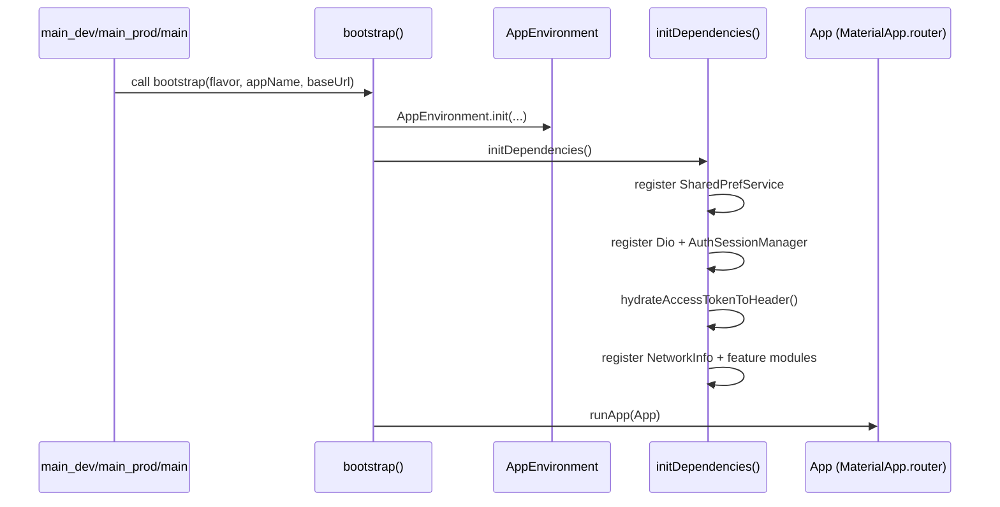
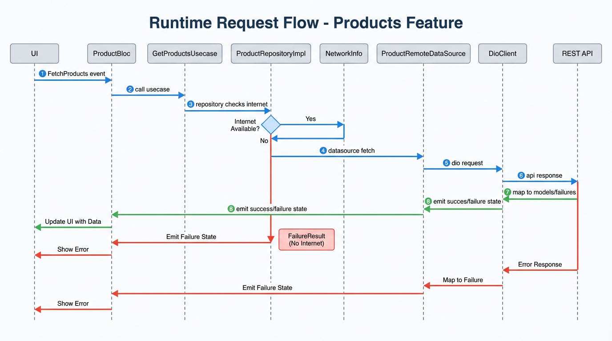
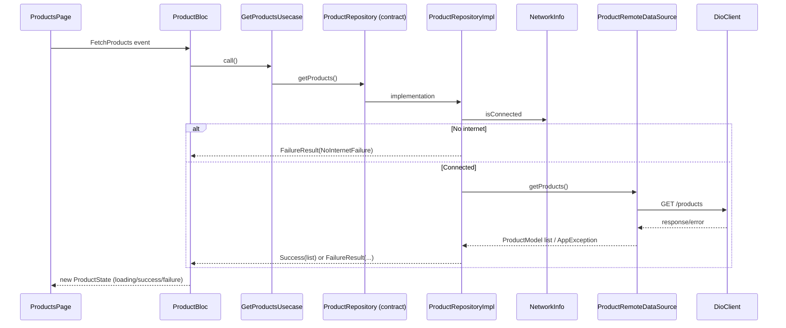
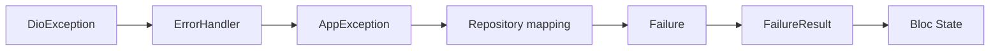
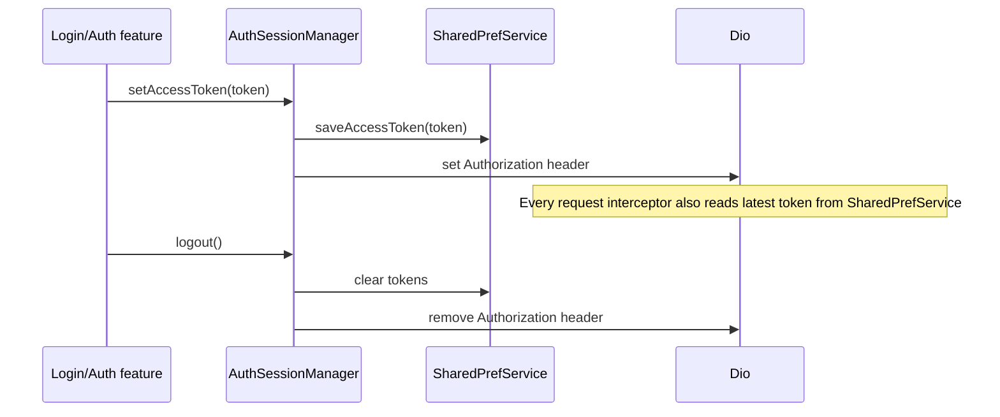

# Clean Arch Base - Architecture Guide

This document explains the architecture, runtime flow, and extension strategy of the project.

## 1) Architecture at a glance

The app follows **Clean Architecture** with clear layer boundaries:

- `presentation` (UI + BLoC)
- `domain` (entities + use cases + repository contracts)
- `data` (repository implementations + data sources + models)
- `core` (cross-cutting infrastructure: DI, network, error, storage, router, theme, constants)

### Visual overview (system-design style)



If your markdown viewer cannot render local image paths, use the Mermaid diagrams in this document (they represent the same architecture).

### Layer dependency rule

- `presentation` -> depends on `domain`
- `domain` -> depends on nothing in framework/data
- `data` -> depends on `domain` + `core`
- `core` -> reusable by all layers, does not depend on feature presentation

```mermaid
flowchart LR
  P[Presentation\n(BLoC, pages, widgets)] --> D[Domain\n(entities, use cases, contracts)]
  D -->|contracts| R[(Repository Interface)]
  DA[Data\n(repo impl, datasource, models)] --> R
  DA --> C[Core\n(network, error, DI, storage, router, constants)]
  P --> C
```

## 2) Project structure

```text
lib/
  main.dart
  main_dev.dart
  main_prod.dart
  src/
    bootstrap.dart
    app.dart
    core/
      config/
      constants/
      di/
      error/
      network/
      router/
      storage/
      theme/
      utils/
    features/
      products/
        data/
        domain/
        presentation/
```

## 3) Application startup flow

The startup pipeline is deterministic and environment-first.



## 4) Request flow (feature example: products)

This is the standard flow every feature should follow.





## 5) Error handling strategy

- Network/dio exceptions are mapped by `ErrorHandler` to typed `AppException`.
- Repository maps exceptions to typed `Failure`.
- BLoC consumes `Result<T>` and emits UI-safe state.
- Strings are centralized in `AppStrings`.



## 6) Auth token and header flow

Token persistence and header synchronization are centralized, so login/logout behavior stays consistent.



## 7) Routing flow

Routing is centralized in `AppRouter` using `go_router`.

- Paths and names in `app_route_paths.dart`
- Route table + fallback in `app_router.dart`
- `MaterialApp.router` in `app.dart`

```mermaid
flowchart TD
  A[MaterialApp.router] --> B[AppRouter.router]
  B --> C[/]
  B --> D[/settings]
  B --> E[errorBuilder]
```

## 8) Theme system

Theme is tokenized and reusable:

- `AppColors`: semantic color tokens
- `AppTextStyles`: typography scale + context extensions (`h1`, `h2`, `bodyMd`, etc.)
- `AppTheme`: complete light/dark `ThemeData`

## 9) How to add a new feature (recommended blueprint)

1. Create:
   - `features/<feature>/domain/{entities,repositories,usecases}`
   - `features/<feature>/data/{models,datasources,repositories}`
   - `features/<feature>/presentation/{bloc,pages,widgets}`
2. Define repository contract in `domain`.
3. Implement datasource + repository in `data`.
4. Add use case in `domain`.
5. Build BLoC in `presentation`.
6. Register all dependencies in `core/di/injection_container.dart`.
7. Add route in `core/router/app_router.dart` and path/name constant.
8. Centralize reusable strings/assets/constants in `core/constants`.

## 10) Non-negotiable conventions

- No API code in `presentation` or `domain`.
- No `BuildContext` usage in `domain`/`data`.
- No hardcoded user-facing messages in feature code; use `AppStrings`.
- Use `Result<T>` for use case/repository boundaries.
- Keep DI centralized in one place.
